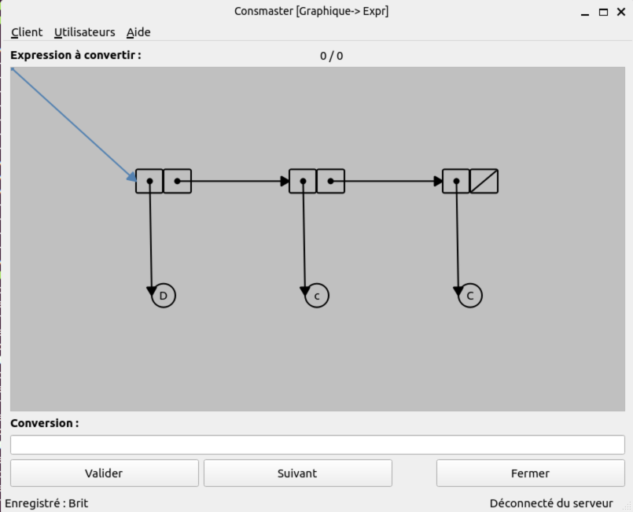
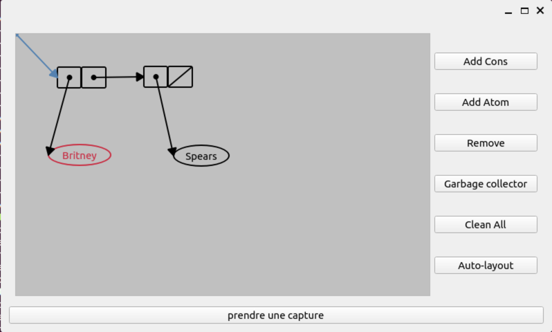

# INTRODUCTION

Ce programme a pour but de vous permettre de vous entrainer à manipuler les différentes représentations lisp : listes simples, notation à points et représentation graphique des doublets.

Interface de Consmaster

Interface de Cons-Drawing

# COMPATIBILITE

Consmaster est compatible et a été testé avec Debian, Ubuntu, Fedora, macOS et Windows.

A cause d'un bug dans Qt6 (qui se propage dans PySide6), il manque une dépendance lorsque l'on installe PySide6.
Pour la majorité des systèmes d'exploitation, il existe une solution (workaround) mais actuellement pas pour CentOS et RedHat.

Le détail des systèmes d'exploitation testés est le suivant:

* Debian: 10, 11
* Ubuntu: 2020.04, 2021.10
* Fedora: 35 Workstation
* macOS: Catalina (10.15), Big Sur (11), Monterey (12)
* Windows: 10, 11

# INSTALLATION

**Note**: *Comme souvent en informatique, il y a de multiples manières de faire quelque chose.
Les procédures d'installation ci-dessous sont juste une de ces manières.*

Pour installer Consmaster, vous devez tout d'abord récupérer les sources puis lancer le script qui correspond à votre système d'exploitation.

## Récupération des sources

Ouvrir un Terminal et téléchargez l'archive dans le répertoire de votre choix:

    wget https://github.com/andrivet/consmaster/archive/refs/heads/master.zip -O consmaster.zip

Si vous n'avez pas `wget` (c'est le cas par défaut sous macOS), vous pouvez utiliser `curl` à la place:

    curl -L -o consmaster.zip https://github.com/andrivet/consmaster/archive/refs/heads/master.zip

Puis décompressez l'archive dans le répertoire de votre choix:

    unzip consmaster.zip
    cd consmaster-master

Sous Windows 10 et 11, les commandes sont légèrement différentes.
Ouvrir un Windows Terminal ou Windows Powershell (pour les anciennes versions de Windows) et entrer les commandes:

    wget https://github.com/andrivet/consmaster/archive/refs/heads/master.zip -O consmaster.zip
    Expand-Archive -LiteralPath consmaster.zip
    cd consmaster/consmaster-master

## Installation des dépendances

Note: Soyez patient, **le téléchargement des dépendances prend plusieurs minutes** (environ 300 MiB à télécharger).

### Ubuntu ou Debian

Pour installer toutes les dépendances de Consmaster, entrer la commande:

    bash install-ubuntu.sh

### Fedora

Pour installer toutes les dépendances de Consmaster, entrer la commande:

    bash install-fedora.sh

## Windows 10 et 11

Installer Python 3, si ce n'est pas déjà fait, depuis Python.org:

    https://www.python.org/downloads/

Puis ouvrir dans le Terminal précédemment ouvert (partie Récupération des sources), entrer la commande:

    pip3 install -r requirements.txt

## macOS

En général, Python 3 est déjà installé. Si ce n'est pas le cas, vous pouvez le télécharger depuis:

    https://www.python.org/downloads/

Puis ouvrir un terminal et entrer la commande:

    pip3 install --user -r requirements.txt

# LANCER CONSMASTER

Après installation, vous pouvez lancer Consmaster avec la commande:

    python3 src/consmaster.py

Sous Windows 10 et 11, la commande est légèrement différente:

    python.exe .\src\consmaster.py

**Note**: *Les instructions précédentes indiquaient d'aller dans le répertoire `src` mais ce n'est plue le cas.*

# REMARQUES GÉNÉRALES

Consmaster peut fonctionner en mode portable depuis le répertoire dans lequel vous l'avez mis.

Attention, ne fermez pas la console pendant l'utilisation du programme sinon vous provoquerez son arrêt.

Le logiciel est prévu à l'origine pour fonctionner avec un serveur qui enregistre votre progression, mais la version fournie ici peut très bien fonctionner localement.

Ne faites pas attention aux éventuels messages d'erreur résultant de l'absence de connexion au serveur.

# UTILISATION DU LOGICIEL

Au premier démarrage du programme, n'hésitez pas à vous enregistrer pour conserver votre progression dans les exercices.

## Mode Standard <-> Dotted

Ce mode vous permet de vous entrainer à passer de la notation simple (normal) à la notation à points (dotted). Les expressions sont tantôt données au format "normal", tantôt au format "dotted", à vous de donner l'expression correspondante dans l'autre format.

Attention à la casse (caractères majuscule ou minuscule). Si vous ne respectez pas la casse des caractères, l'expression sera considérée comme fausse.

Consmaster ne corrige pas le pretty print : faites attention à ne pas prendre de mauvaises habitudes...

## Mode Expr -> Graphique

Ce mode vous permet de vous entrainer à passer de la notation simple (normal) à la représentation graphique. Pour ajouter un doublet ou un atome utilisez respectivement les boutons "Add Cons" et "Add Atom". "Remove" supprime l'élément courant (en rouge). "Garbage collector" permet de supprimer du schéma tous les doublets et atomes qui ne sont pas connectés. "Clean All" permet de repartir à zéro. "Auto-layout" permet d'ajuster automatiquement le positionnement des doublets et atomes pour avoir un schéma propre.

Pensez à agrandir la fenêtre si les éléments se chevauchent et le schéma devient illisible...
Utilisez le clic droit (cliquer/glisser) pour créer les liens.
Un double clic sur un atome permet de modifier son contenu.

## Mode Graphique -> Expr

Ce mode vous permet de vous entrainer à passer de la notation graphique à la notation simple (normal).

La aussi le pretty print n'est pas vérifié. Faites attention à bien respecter les espaces entre chaque atome et entre les parenthèses. Attention il n'y a jamais d'espace après une parenthèse ouvrante ou avant une parenthèse fermante.

# UTILISATION DE CONS_DRAWING POUR CREER DES SCHEMAS

Pour créer des schémas pour répondre aux exercices du cours de lisp, vous pouvez lancer le programme Cons_drawing :

Depuis le répertoire `consmaster`, lancer la commande :

    python3 src/cons_drawing.py

Sous Windows 10 et 11, la commande est légèrement différente:

    python.exe .\src\cons_drawing.py

Vous pouvez dessiner votre schéma correspondant avec les mêmes outils que dans Consmaster. Vous pouvez alors enregistrer le schéma en cliquant sur le bouton "prendre une capture". Choisissez un nom et un emplacement pour enregistrer l'image.
Vous pouvez ensuite importer cette image dans votre traitement de texte favori pour rédiger les réponses aux exercices.

# Historique

## Version 0.6

Consmaster a été porté sur PySide6 (Qt6) par Sébastien Andrivet parce que la version précédente utilisait PySide qui ne s'installe plus sur les versions récentes de Linux (Ubuntu, Debian).
Cette version s'appuie sur la version 0.5 et aussi sur le travail de gsebg (https://github.com/gsebg/consmaster_patch).

## Version 0.5

Consmaster a été réalisé par Josué Melka, Calev Eliacheff et David Calmeille dans le cadre du projet de L2.
